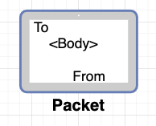

## crawler basic  

일반적으로 '크롤러', 'Web 스크래퍼' 라는 단어를 듣게되면 다음과 같은 일을 할 수 있을것이라 기대한다.  
- 도메인 이름을 받고, 원하는 HTML 정보를 가져옴  
- 페이지로부터 데이터를 파싱하여 원하는 정보를 얻음  
- 원하는 정보를 저장함 (DB등)  

즉, 웹으로 부터 페이지 정보를 획득하고 (Raw data) 이를 잘 처리하여 (전처리) 원하는 정보로 가공하는 행위를 말한다.  
크롤러를 만든다 함은 이를 자동으로 수행하는 일종의 '봇'을 만드는 것 이다.  

이를 공부하기전에, 네트워크에 대한 기초를 잡고가자  

### Network basic  
Network는 다음의 흐름으로 구성된다. 느낌만 알아두자   

1. Desktop에서 0과 1로 구성된 비트스트림(바이트의 나열) 을 보낸다. 각 비트는 '전압'으로 구별된다. 이 비트가 '정보'를 만들어내는 것이다. 정보에는 '헤더'와 '바디'도 포함되어 있는데 헤더에는 Desktop의 MAC주소와 Server의 IP주소가 존재하고, 바디에는 Server에 요청하는 내용이 들어 있음  
2. Desktop의 라우터는 비트를 받아 이를 '패킷'으로 해석함. Desktop의 고유 IP 주소를 패킷에 'from'으로 기록한 다음 라우터가 인터넷에 정보를 전송함  
3. 패킷은 여러 경로를 (여러 중간 서버)를 거쳐 최종 목적지 Server에 도달함  
4. Server에서 패킷정보를 얻음  
5. Server에서 헤더에서 패킷 포트의 목적지 (적용하고자 하는 어플리케이션)를 읽고 목적지로 전송한다.  
6. 최종 목적지(Server내 어플리케이션)인 어플리케이션은 서버 프로세서에서 데이터 스트림을 받는다. 
7. Server는 해당하는 HTML 파일을 찾고 새 패킷으로 묶어 다시 Desktop으로 보낸다. 보내는 과정은 위의 과정의 반복이다.  

즉, 데스크탑과 서버는 '패킷'의 단위로 데이터를 송/수신하고 패킷에는 가고자하는 목적지와 보내는 사람의 주소, 그리고 내용이 담겨있다.  
  

  
Python에서는 단 세줄로 위에서 7단계로 설명한 일을 실행 할 수 있다.  
```python
from urllib.request import urlopen
# 해당 페이지의 모든 HTML 정보를 받아왔다.
# 이는 도메인 네임 http://pythonscraping.com에 존재하는 서버의 /pages 디렉토리의 page1.html 정보를 가져온것
# page보다 파일의 개념으로 생각하는게 좋다.
html = urlopen('http://pythonscraping.com/pages/page1.html')
print(html.read())
```

앞으로 웹스크래핑을 하기위해서 주로 python 표준라이브러리인 urllib 와 BeautifulSoup이라는 라이브러리를 사용 할 예정이다.  

자세한 내용은 basic01.ipynb 참조.  

## Reference  
- Web scraping with python 